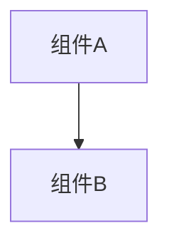

# 变更提案: docs-book-blog-style

## 元信息
```yaml
类型: 优化
方案类型: implementation
优先级: P2
状态: 已确认
创建: 2026-02-25
```

---

## 1. 需求

### 背景
根目录的 `README.md` 与 `docs/SUMMARY.md` 已经包含了大量“可运行的学习入口”和导航信息，但整体更接近“说明书/索引页”的阅读体验：信息密度高、跳转多、节奏快。

这会带来两个典型问题：

- 第一次进仓库的读者，很难在 30 秒内抓到“我该怎么开始、先跑哪个、怎么验证自己真的理解了”。
- 已经在用的读者，虽然能靠索引直达，但读起来更像“查表”，缺少书籍/博客式的承接（为什么先做这个、做完应该得到什么、下一步往哪走）。

本次改写希望把“信息”保留下来，但把“叙事”和“读者路径”补齐，让它更像一本可跑的书的封面与目录，而不是工具生成的文案。

### 目标
- 把根 `README.md` 改写为更像“封面/前言 + 读者路线图”的文字：更好读、更好开始、更容易坚持。
- 在不破坏现有链接与命令可用性的前提下，降低“AI 生成感”（模板化口号、机械分点、无承接的条目堆叠）。
- 给 `docs/SUMMARY.md` 增加“怎么读/怎么维护”的导语，让它既是站点 SSOT 目录，也像一本书的目录页。

### 约束条件
```yaml
时间约束: 无硬性时间约束
性能约束: 文档改写不应引入额外构建/测试成本
兼容性约束: GitHub Markdown 渲染可读；`docs-site` 侧边栏解析不受影响（`docs/SUMMARY.md` 的 `<!--nav-->` 与其下列表结构保持）
业务约束: 不改代码与模块内容，仅改仓库根 `README.md` 与 `docs/SUMMARY.md` 的表达与结构
```

### 验收标准
- [ ] `README.md` 第一屏清晰给出“从哪里开始 / 最短跑通闭环 / 如何验证理解”
- [ ] `README.md` 内的命令、端口说明、文件路径与相对链接保持可用
- [ ] `docs/SUMMARY.md` 的 `<!--nav-->` 标记与其下导航列表结构不变（站点导航不被破坏）
- [ ] 文案更像书/博客：有开场问题、节奏承接与小结；避免模板化“AI 语气”

---

## 2. 方案

### 技术方案
这是一次“写作结构重排 + 文案重写”的改动，不涉及代码实现。改写原则：

- **先给读者一条路**：先跑通一个模块，再用 Labs/Exercises 把现象固化成证据链，最后再去深挖机制章节。
- **让索引为叙事服务**：索引不删，但把“超长清单”折叠，避免把读者按进信息洪水里。
- **链接与命令优先**：不移动文件、不改路径，最大化保持既有链接稳定。

### 影响范围
```yaml
涉及模块:
  - 根文档: `README.md`（封面/前言/读者路线图）
  - 站点导航: `docs/SUMMARY.md`（SSOT 目录 + 导语）
预计变更文件: 2
```

### 风险评估
| 风险 | 等级 | 应对 |
|------|------|------|
| 破坏 docs-site 导航解析（`docs/SUMMARY.md`） | 中 | 保持 `<!--nav-->` 与其下列表结构不变，仅改 nav 之前的导语文本 |
| 相对链接断链（读者无法直达模块/章节） | 中 | 对 `README.md` 与 `docs/SUMMARY.md` 做相对路径存在性自检 |
| “书籍化”过度导致信息不好查 | 低 | 不删除索引；用折叠与更明确的入口引导降低第一屏噪音 |

---

## 3. 技术设计（可选）

> 本变更为文档改写，不涉及架构、API 或数据模型调整。

### 架构设计


### API设计
#### {METHOD} {路径}
- **请求**: {结构}
- **响应**: {结构}

### 数据模型
| 字段 | 类型 | 说明 |
|------|------|------|
| {字段} | {类型} | {说明} |

---

## 4. 核心场景

> 执行完成后同步到对应模块文档

### 场景: 第一次打开仓库（读者入门）
**模块**: 根文档
**条件**: 读者只知道“想学 Spring Boot / Spring Core”，但不知道从哪开始
**行为**: 按 `README.md` 的“最短上手”跑通一次 `mvn -q test`，并进入一个模块的 `docs/README.md` 继续阅读
**结果**: 读者获得“可跑入口 + 读法 + 下一步”的确定感（不是只看到索引清单）

---

## 5. 技术决策

> 本方案涉及的技术决策，归档后成为决策的唯一完整记录

### docs-book-blog-style#D001: 采用“叙事优先 + 索引折叠”的根 README 结构
**日期**: 2026-02-25
**状态**: ✅采纳
**背景**: 根 README 同时承担“封面导读”和“大型索引”的职责。完全保留清单会让第一屏像说明书；完全删掉清单又会降低查阅效率。
**选项分析**:
| 选项 | 优点 | 缺点 |
|------|------|------|
| A: 维持“开放式长清单” | 直达性强；信息一眼全在 | 第一屏噪音大；更像目录表格而不是文章 |
| B: 叙事优先 + 折叠索引（`<details>`） | 第一屏更像封面/博客；读者路径更清晰；索引仍可查 | 需要点一下展开；部分渲染器不支持（GitHub 支持） |
**决策**: 选择方案 B
**理由**: 兼顾“更好读”与“仍可查”。在 GitHub 场景下 `<details>` 足够稳定，且对不支持的渲染器也只是退化为普通文本（不影响链接本身）。
**影响**: 仅影响根 `README.md` 的结构与呈现方式，不影响模块内容与代码行为。 
