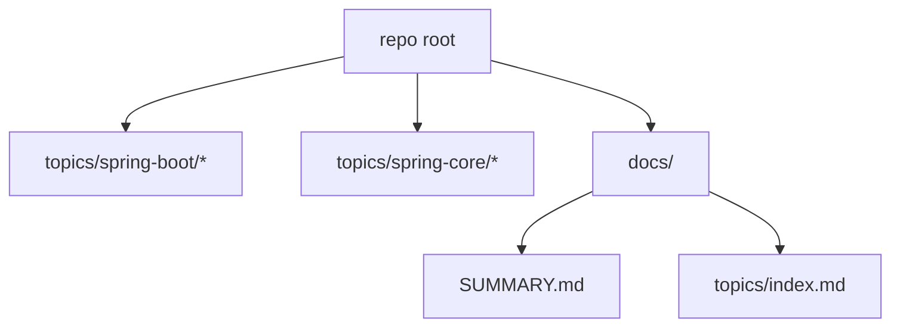

# Technical Design: Tutorials 风格结构重排与深度化改造

## Technical Solution
### Core Technologies
- Maven 多模块聚合
- Markdown / MkDocs 文档体系

### Implementation Key Points
- 建立“主题 → 模块目录”映射表，明确迁移路径与新入口命名。
- 迁移模块目录与聚合 POM，同步更新 root 与主题级聚合。
- 文档入口统一到 `docs/SUMMARY.md` 与主题索引，消除多源导航。
- 优先模块按固定深挖结构补齐证据链（源码入口/调用链/断点/分支矩阵/Lab）。
- 迁移阶段保持“旧入口可追踪到新入口”的提示与兼容策略。

## Architecture Design

## Architecture Decision ADR
### ADR-001: 采用主题顶层分组的模块目录重排
**Context:** 当前模块分布与 tutorials 风格差异大，入口与导航对齐成本高。  
**Decision:** 引入主题顶层分组目录，并按主题迁移模块位置。  
**Rationale:** 统一入口与浏览习惯，降低读者认知成本。  
**Alternatives:** 保持现有目录，仅改文档导航 → 不解决结构对齐与入口一致性问题。  
**Impact:** 需要迁移模块路径与聚合 POM，更新文档索引与链接。

## Security and Performance
- **Security:** 无外部服务变更；防止路径移动导致误引用旧文件
- **Performance:** 仅文档与目录调整，对运行时无影响

## Testing and Deployment
- **Deployment:** 按“结构迁移 → 文档同步 → 验证”顺序推进
