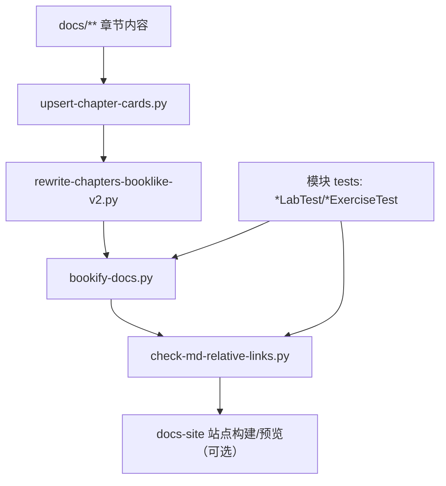

# Technical Design: 全量文档加深（docs-deepen-all）

## Technical Solution

### Core Technologies

- Java 17 / Maven 多模块（父 `pom.xml` 统一管理）
- JUnit 5 + AssertJ（`*LabTest/*ExerciseTest/*ExerciseSolutionTest`）
- Markdown 文档体系（`docs/**`）与站点（`docs-site/**`）
- Python3 文档自动化脚本（`scripts/*`：bookify / rewrite / link-check / audit）

### Implementation Key Points

1. **章节契约（Chapter Contract）落地为“可自动检查”的门禁**
   - 目标：每章至少具备“要点/主线/关键分支/验证入口/断点包/坑位/自检题/稳定尾部块”。
   - 手段：新增/增强检查脚本输出缺失清单，并支持 `--module` 子集运行，便于增量改造。

2. **以脚本保证“可导航 + 幂等尾部块”**
   - `scripts/bookify-docs.py`：为每个章节 upsert 尾部入口块（对应 Lab/Test）与“上一章｜目录｜下一章”导航。
   - `scripts/check-md-relative-links.py`：保证仓库内相对链接不断链（断链视为失败）。

3. **以“章节学习卡片（五问闭环）”作为自动化生成骨架的事实来源（SSOT）**
   - `scripts/upsert-chapter-cards.py`：为章节 upsert 五问卡片（知识点/怎么用/原理/源码入口/推荐 Lab）。
   - `scripts/rewrite-chapters-booklike-v2.py`：基于卡片为章节补齐更稳定的“导读/证据链/小结”骨架，避免空块与重复入口。

4. **Labs/Exercises 的覆盖策略**
   - Labs：用于“证据链”，断言机制结论（稳定契约/可观察信号）。
   - Exercises：用于“练习缺口”，默认 `@Disabled`，将读者指向对应章节与推荐断点。
   - Solutions：用于对照自检，默认参与回归。

5. **性能与并发语义的落地方式**
   - 对存在并发/代理/缓存/事务语义的模块，补齐：
     - “为什么会慢/为什么会错”的分支解释；
     - 可重复的实验入口（LabTest）固化现象与边界。

## Architecture Design

## Architecture Decision ADR

### ADR-001: 以“章节契约 + 可跑入口”作为文档质量门禁
**Context:** 全量文档规模大，纯人工维护易漂移，且“面试复习/源码级深入”需要可验证闭环。  
**Decision:** 引入/增强自动化脚本：章节学习卡片 + 章节骨架重写 + 书本化尾部块 + 相对链接检查 + 模块入口审计。  
**Rationale:** 自动化保证一致性与可维护性，同时保留人工对关键章节的深挖空间。  
**Alternatives:** 纯人工补齐 → 拒绝原因：成本高、难长期一致。  
**Impact:** 增加脚本与检查流程，但显著降低全量维护成本并提高可回归性。

## Security and Performance

- **Security：**
  - 脚本仅在仓库内读写，不触发外部网络调用；
  - 文档与测试示例避免真实敏感信息；
  - Exercises 默认禁用，避免“练习缺口”破坏回归稳定性。
- **Performance：**
  - 脚本支持按模块子集执行（`--module`），避免全量重写带来的长耗时；
  - 全量批处理优先 dry-run 与报告输出，减少误改风险。

## Testing and Deployment

- **Testing：**
  - 文档检查：`python3 scripts/check-md-relative-links.py --root docs`
  - 书本化：`python3 scripts/bookify-docs.py`（建议连跑两次验证幂等）
  - 卡片与骨架：`python3 scripts/upsert-chapter-cards.py` + `python3 scripts/rewrite-chapters-booklike-v2.py`
  - 模块验证：`bash scripts/test-module.sh <artifactId>`（优先对本次改动模块跑）
- **Deployment（可选）：**
  - 本地预览：`mkdocs build -f docs-site/mkdocs.yml`（若环境具备）

