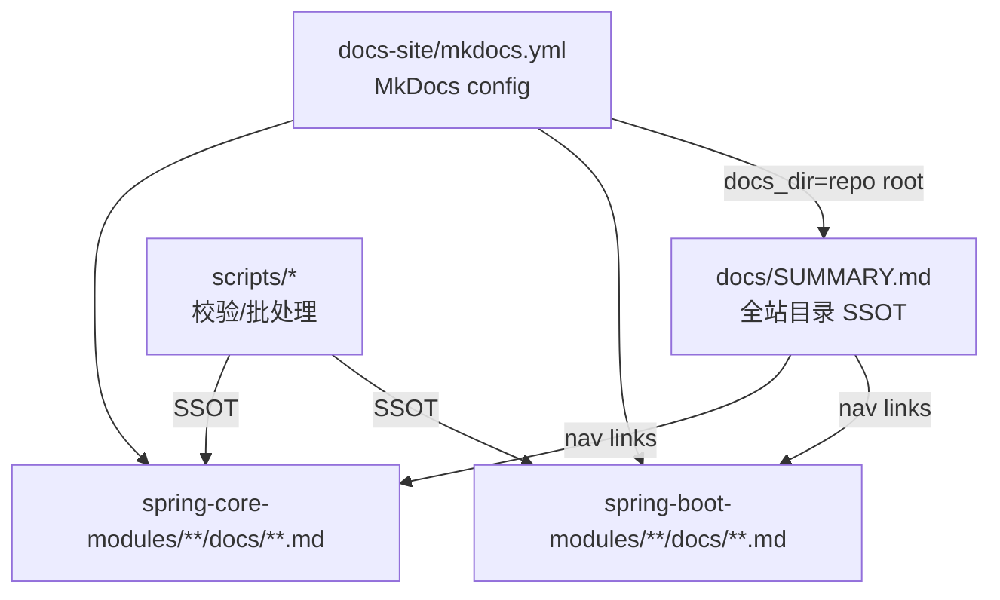

# Technical Design: 文档归并（以模块 */docs 为 SSOT，docs 仅保留总目录）

## Technical Solution

### Core Technologies
- Markdown 文档组织
- MkDocs Material（`docs-site/`）
- `mkdocs-literate-nav`（以 Markdown 目录文件生成导航）
- Python/Shell 脚本（`scripts/`）用于目录生成与批量修复链接

### Implementation Key Points

1. **MkDocs 以仓库根作为 docs_dir**
   - 目标：让导航可以直接引用 `spring-boot-modules/**/docs/**.md` 与 `spring-core-modules/**/docs/**.md`
   - 做法：将 `docs-site/mkdocs.yml` 的 `docs_dir` 从 `../docs` 调整为仓库根（`..`），并把 `literate-nav.nav_file` 指向 `docs/SUMMARY.md`

2. **全站目录（`docs/SUMMARY.md`）改为“聚合模块 docs”**
   - 以目录文件为 SSOT，不再要求内容在 `docs/` 目录中
   - 目录内容按模块分组，覆盖每个模块 `docs/` 下的所有 `.md`
   - 目录生成建议脚本化（避免手工维护 300+ 条目），并保持输出稳定（排序/缩进规则固定）

3. **删除根 docs 的模块内容副本**
   - `docs/` 下除 `SUMMARY.md` 外的模块目录全部删除
   - 目标是彻底消除“双份文档漂移”的根因

4. **移除 Book（docs/book）与残余引用**
   - 删除 `docs/book/`
   - 批量清理模块 docs 中的 `Book TOC`、`book/*.md` 导航链接
   - 根 `README.md` 与 `helloagents/wiki/*` 同步移除 Book 入口与链接

5. **脚本工具链适配新 SSOT**
   - 现有多个脚本默认以 `docs/<topic>/<module>/README.md` 为章节清单 SSOT
   - 统一调整为以 `<module>/docs/README.md`（模块内目录页）为 SSOT
   - 兼容历史命名（如 `springboot-*` → `spring-boot-*`）继续由 `scripts/repo_paths.py` 提供映射

## Architecture Design

## Security and Performance

- **Security:**
  - 不引入外部服务调用，不处理敏感信息
  - 主要风险来自“批量删除/改写文档导致不可逆损失”，需确保 Git 可回退、并在执行前后做校验
- **Performance:**
  - 文档站构建的 `docs_dir` 变大（指向仓库根），但实际渲染仅按 SUMMARY 引用的页面生成；构建耗时预期可接受

## Testing and Deployment

- **Testing:**
  - 断链检查：对 `spring-boot-modules/**/docs/**.md` 与 `spring-core-modules/**/docs/**.md` 执行相对链接校验
  - MkDocs：`mkdocs build`/`mkdocs serve` 验证目录解析与页面渲染
  - 脚本：运行 `scripts/check-chapter-contract.py` 等依赖 SSOT 的脚本，确认不再依赖旧 `docs/<topic>/...` 结构
- **Deployment:** 无（文档站发布工作流当前仓库未内置）

