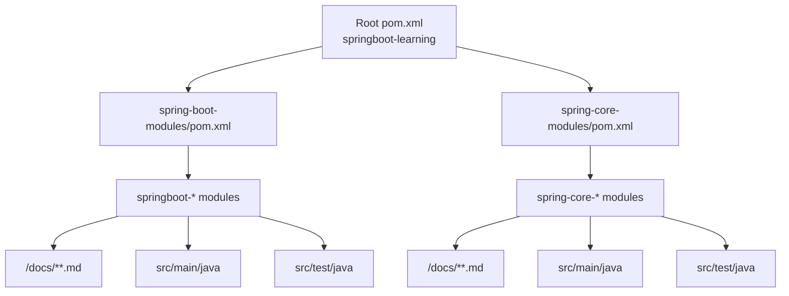

# 架构说明（Architecture Design）

## 1. 总体架构

本仓库是一个 **Maven 多模块学习工程**。为了让目录结构更接近 `tutorials` 风格、便于按领域扩展与浏览，代码模块按“Spring Boot / Spring Core”分组放在两个父目录下：

- `spring-boot-modules/`：Spring Boot 相关模块（`springboot-*`）
- `spring-core-modules/`：Spring Core 相关模块（`spring-core-*`）

根 `pom.xml` 仅聚合这两个“分组聚合 POM”（`spring-boot-modules/pom.xml`、`spring-core-modules/pom.xml`），再由它们继续聚合具体模块。

每个模块围绕一个主题提供：

- `README.md`（导航索引）
- `docs/`（分章节说明）
- `src/main/java`（可运行最小示例，视模块而定）
- `src/test/java`（Labs/Exercises：可断言的实验）

## 2. 技术栈

- **Java:** 17
- **Spring Boot:** 由父 POM 统一管理
- **构建:** Maven
- **测试:** JUnit 5 / AssertJ（由 `spring-boot-starter-test` 提供）

## 3. 关键设计选择（ADR 索引）

> 本仓库以学习为目标，通常不做“重架构”。若某次变更需要做关键取舍，会在对应变更的 `how.md` 中记录 ADR，并在此处维护索引。

| adr_id | 标题 | 日期 | 状态 | 影响模块 | 详情 |
| --- | --- | --- | --- | --- | --- |
| ADR-001 | 以“可断言实验”作为学习闭环 | 2026-01-01 | ✅Adopted | 全部 | 见各模块 Labs/Exercises 设计 |
| ADR-002 | 按 tutorials 风格分组聚合模块 | 2026-01-20 | ✅Adopted | 全部 | 见 `helloagents/history/2026-01/202601201248_tutorials_style_reorg/how.md` |
